Docker Remote Debugging
=======================

To connect to python remote interpreter inside docker, you have to make sure
first, that Pycharm is aware of your docker.

Go to `Settings > Build, Execution, Deployment > Docker`. If you are on linux,
you can use docker directly using its socket  `unix:///var/run/docker.sock`,
if you are on Windows or Mac, select `Docker for Mac` or `Docker for Windows`.

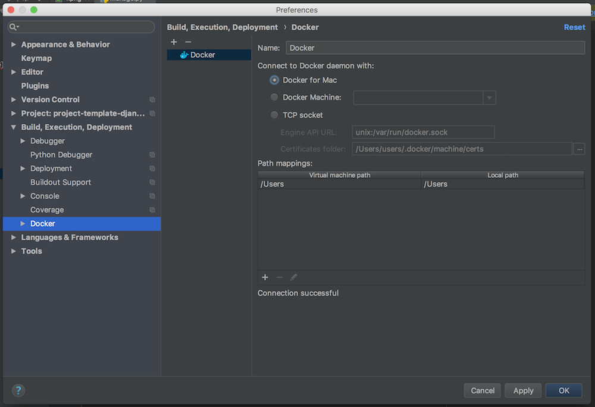

Configure Remote Python Interpreter
-----------------------------------

This repository comes with already prepared `Run/Debug Configurations` for docker.

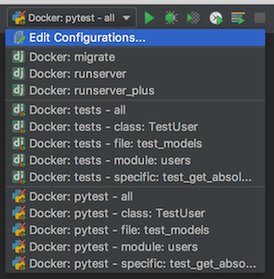

But as you can see, at the beggining there is something wrong with them. They
have red X on django icon, and they cannot be used, without configuring remote
python interpteter. To do that, you have to go to
`Settings > Build, Execution, Deployment` first.

Next, you have to add new remote python interpreter, based on already tested
deployment settings. Go to `Settings > Project > Project Interpreter`.
Click on the cog icon, and click `Add Remote`.

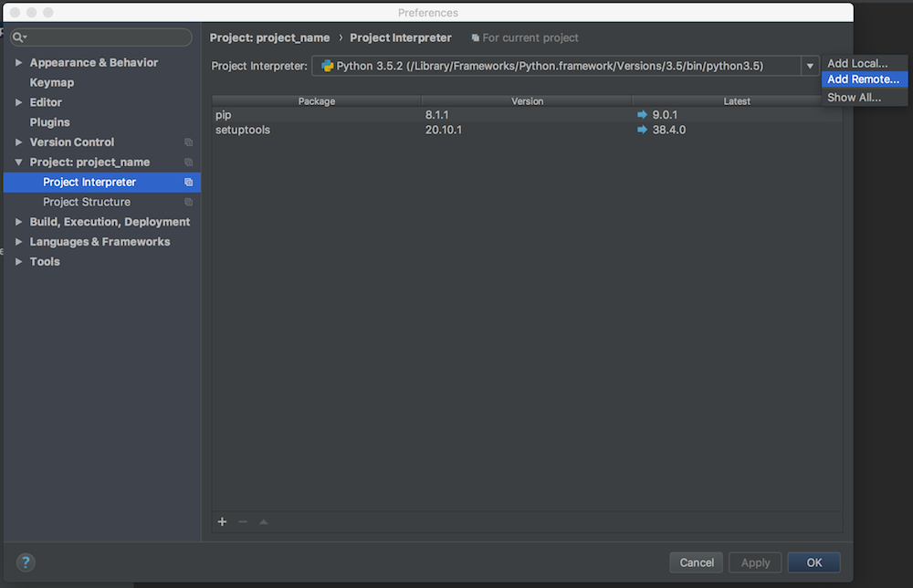

Switch to `Docker Compose` and select `local.yml` file from directory of your
project, next set `Service name` to `django`

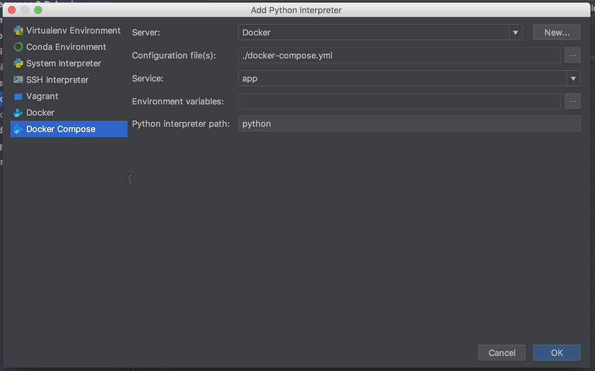

Having that, click `OK`. Close `Settings` panel, and wait few seconds...

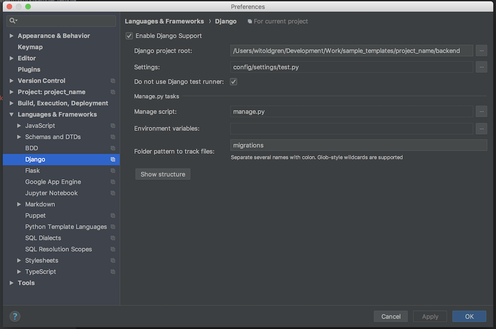

Set Django configuration

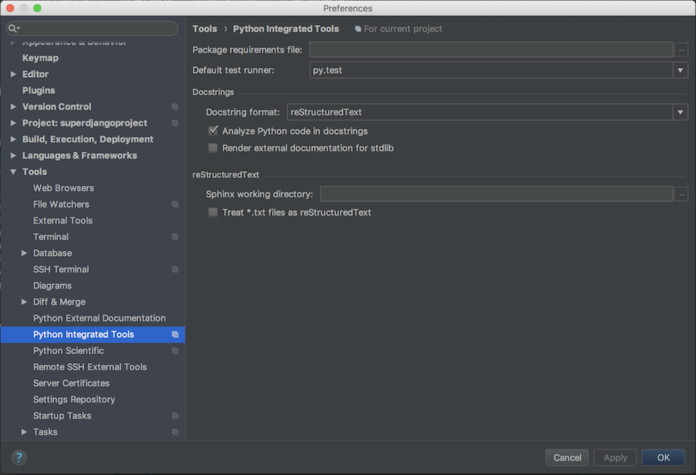

Set PyTest default runner

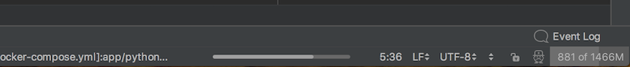

After few seconds, all `Run/Debug Configurations` should be ready to use.

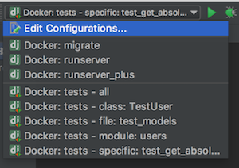

**Things you can do with provided configuration**:

* run and debug python code

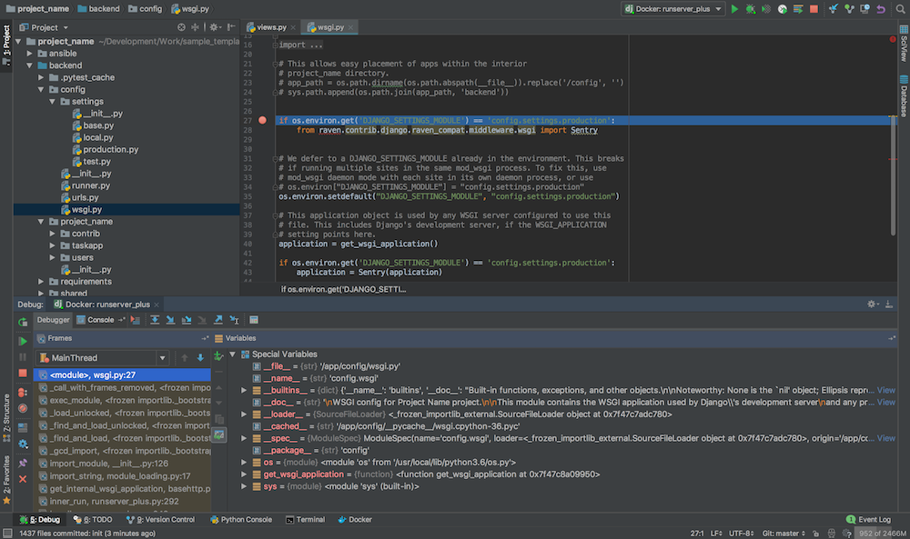

* run and debug tests

.. image:: images/f2.png

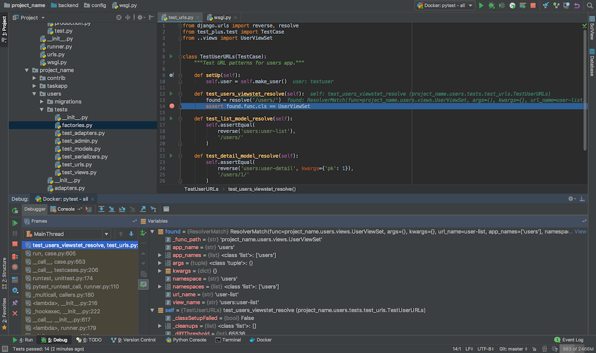

* run and debug migrations or different django management commands

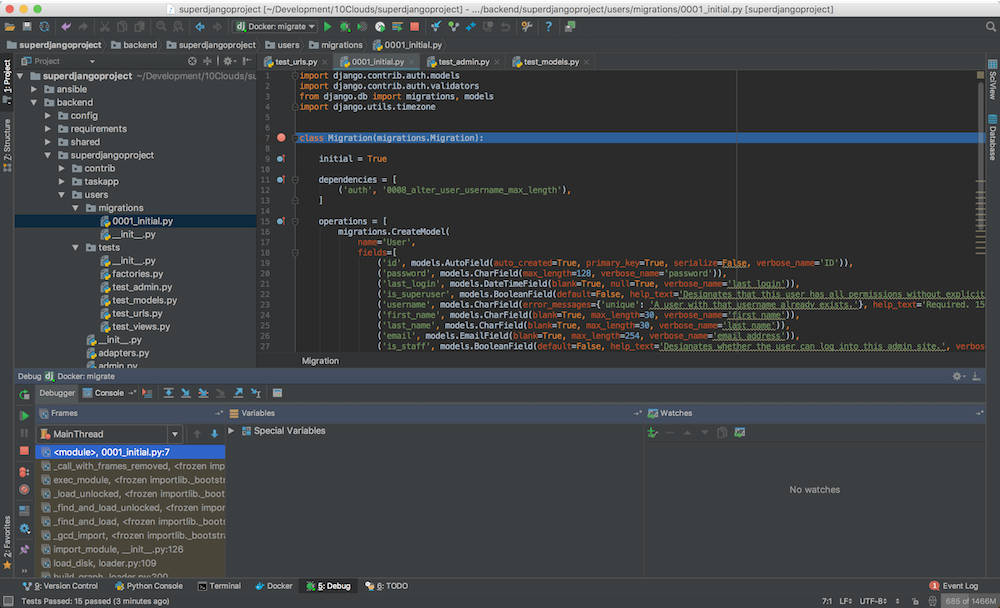

* run code coverage

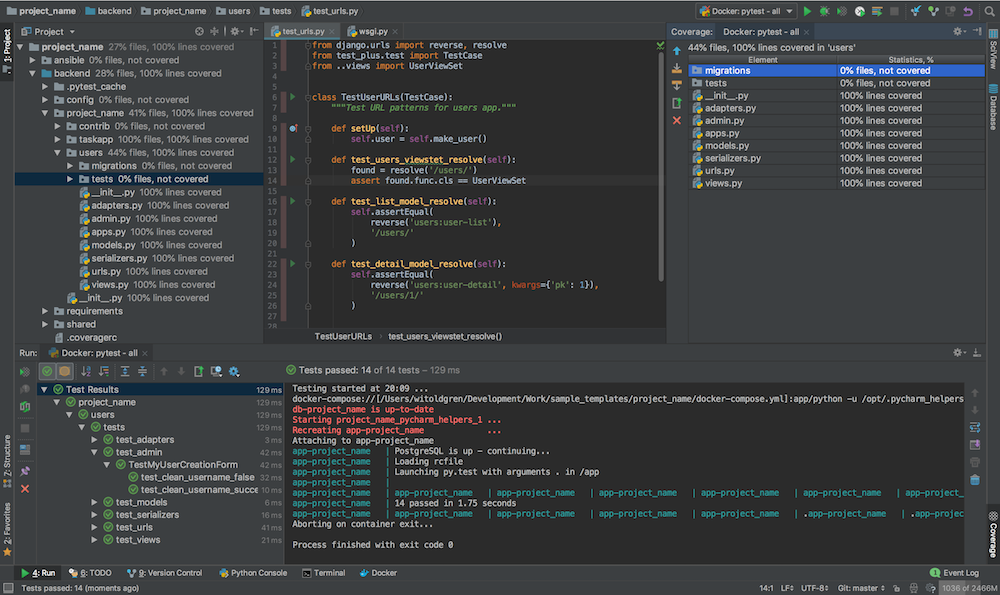

* and many others..

Known issues
------------

* Pycharm hangs on "Connecting to Debugger"

.. image:: images/issue1.png

This might be fault of your firewall. Take a look on this ticket -
https://youtrack.jetbrains.com/issue/PY-18913

* Modified files in `.idea` directory

Most of the files from `.idea/` were added to `.gitignore` with a few exceptions,
which were made, to provide "ready to go" configuration. After adding remote
interpreter some of these files are altered by PyCharm:

.. image:: images/issue2.png

In theory you can remove them from repository, but then, other people will
lose a ability to initialize a project from provided configurations as you did.
To get rid of this annoying state, you can run command:

.. code-block:: bash

    $ git update-index --assume-unchanged blogchain.iml
